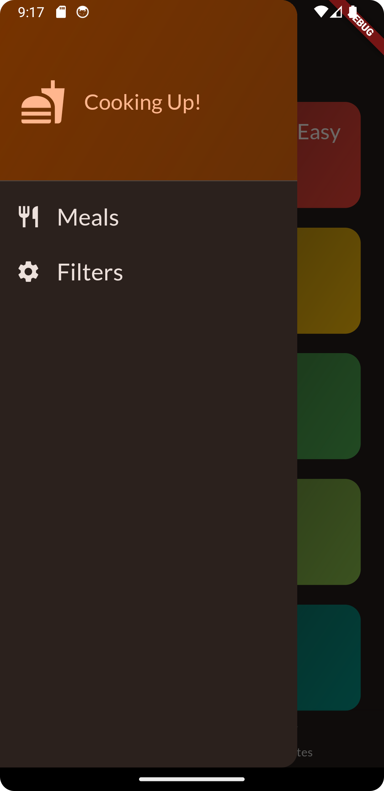

Welcome to the Flutter-course repo !
===

This repo is about a Flutter app. This is still in WIP.

## 1. Dice roll

// todo add images

## 2. Quizz

// todo add images

## 3. Expense tracker

// todo add images

## 4. Meals

### Home and menu
  

 

## 5. Shopping list

// todo add images

## 6. Favorite places

// todo add images
